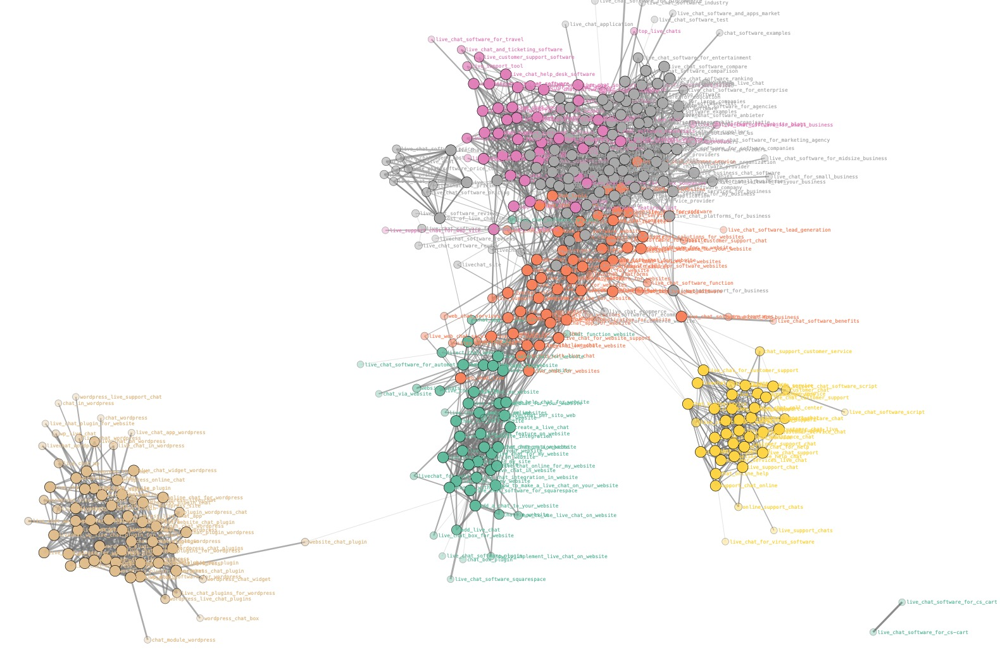

# Automate Google Ads Negative Keywords

## Problem
When you are running Google Ads campaigns, 
you need to add negative keywords to avoid showing your ads for irrelevant search queries.
Even if you add exact match keywords to your ad group, you still need to add negative keywords because Google suggests your ads for similar search queries.
It is very time-consuming to add negative keywords manually, especially when you have a lot of keywords in your ad group.

## Our solution
We analyze all new search queries suggested by Google in our ad group every hour. 
We store all keywords to FlowHunt SERP clousters and let FlowHunt to identify the intent of the keyword based on the other keywords in the same SERP cluster.

If new keyword match the intent of other keywords in the ad group, we add the keyword to the ad group as "Added"
If new keyword does not match the intent of other keywords in the ad group, we add the keyword to the ad group as "Excluded"

Thanks to hourly script running in the Google Ads account, we make sure we don't loose money on irrelevant search queries.
As result keywords are not mixed between different ad groups and we are able to optimize intent of each keyword with the Ad and destination landing page intent.

## Installation
1. Add to your Google Drive Google Sheet file: [Copy Google Sheet](https://docs.google.com/spreadsheets/d/1N-CbzkiIPO34ei8YImF1kDc9asx6XWOo/copy)
2. Create FlowHunt account: [FlowHunt](https://flowhunt.io/)
3. Get FlowHunt [API key] (https://app.flowhunt.io/flow/api-keys)
4. Save the API key to the Google Sheet in the cell `B3` in the `Settings` sheet (FlowHuntAPIkey setting), review also other settings in the `Settings` sheet if you need more precise control over the script
5. Visit [Google Ads Scripts](https://ads.google.com/aw/bulk/scripts/management) and copy [Google Ads Script](google_ads_script.ga) to your Google Ads account
Set the URL to your new Google Sheet in the script by changing the value of the `spreadsheetURL` variable in the first line of the script
6. Run the script hourly to analyze new search queries and add negative keywords to your ad group
7. Mark all groups you want to analyze with Label `FlowHunt` in Google Ads. Just Enabled groups in Enabled campaigns with label `FlowHunt` will be analyzed. All other ad groups will be skipped.
8. Check the Google Sheet for new keywords and their status, Google sheet has 2 tabs AddedKW and NegativeKW - check them to see the results of the script

## SERP Keyword Clusters Visualisation

Visit simple streamlit application to visualize your keyword clusters stored in FlowHunt
Use the same API key as in the Google Sheet to visualize the keyword clusters
https://flowhunt-serp-keyword-clusters.streamlit.app/

## Costs
FlowHunt is free for the first 500 keywords as each user get $5 credit. To analyze one keyword costs $0.01.
One cent is nothing compared to the cost of irrelevant clicks in Google Ads - in our case some irrelevant clicks cost $50 and as soon as possible we mark the keyword as negative, sooner we are protected.

Example from our own campaign shows that each month we have about 7000 new negative keywords, which costs us $70 to analyze, but saved us budget in range of 20 000 USD - 35 000 USD per month.

In case you need help with setting up the script, feel free to contact us at [support@flowhunt.io](mailto:support@flowhunt.io)